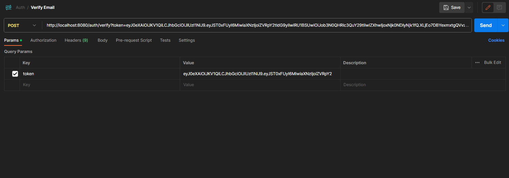
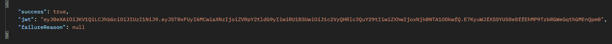
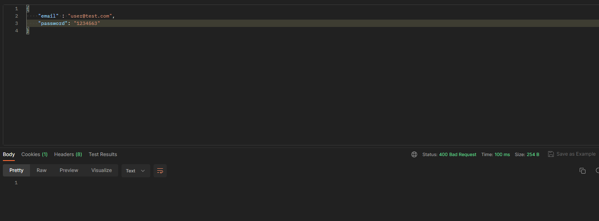

# eTicketor

# Welcome to eTicketor API

This API enables hosts to create events and event goers to purchase ticket for the events online

Tools required to run the application are:

IntelliJ IDEA

smtp4dev (fake smtp server) https://github.com/rnwood/smtp4dev/releases/download/3.2.0-ci20221023104/Rnwood.Smtp4dev-win-x64-3.2.0-ci20221023104.zip

SQL Database

Dependency with route mapping, rate limiting and circuit breaking. https://github.com/DennisMatambanadzo/CloudGateway

****************

The entities involved are:

User,
Ticket,
Event.

# User

### Registration

This system houses users with three different roles: User, Admin and Host.

For each, registration requires a firstname, lastname, email, and password.

The registration provides the following response:

The next step is to check the stmp server for an email with a provided token and copy the token to verify the email.

The email verification process takes place by copying the token and pasting it into the *verify email* endpoint

At that point the user email is verified.

### Login

After verification the user can log in.

The system supports three points of entry for the users depending on the role the registered for.

To login the user enters their email and password.

If the email exists in the system and the password matches the API will respond with a JWT token 
that will be used to authenticate and authorize the user for each endpoint they attempt to access.

If both conditions above are not met the API responds with a Bad Request (400) message

